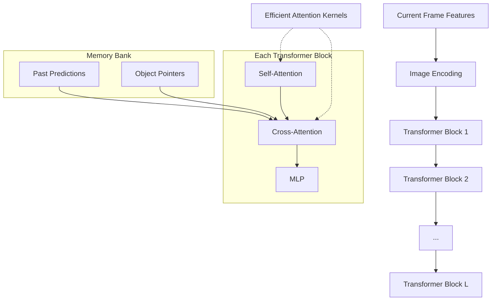
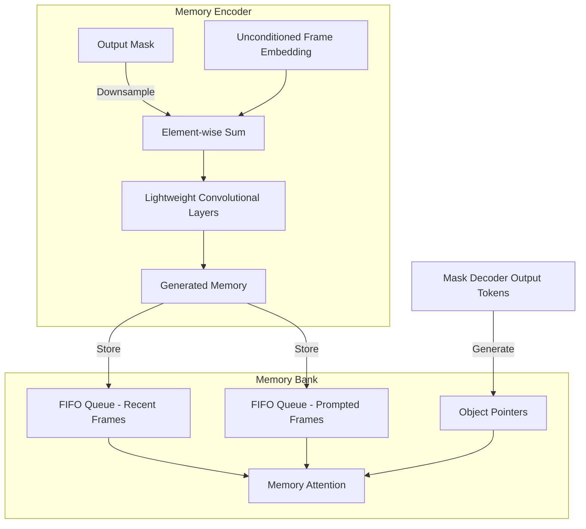

# Motivation
- Propose a new model that is faster than [[Segment Anything|SAM]] in image segmentation
- Apply **streaming memory** to tackle with video segmentation
# Task: prompt-able visual segmentation
The PVS task allows providing prompts to the model on any frame of a video. Prompts can be **positive / negative clicks, bounding boxes, or masks**, either to define an object to segment or to refine  a model-predicted one.

# Model
![[AI-SAM2-Arch.png]]
## General Process
For a given frame, the segmentation prediction is conditioned on the current prompt **and/or** on previously observed memories. Videos are processed in a streaming fashion with frames being consumed **one at a time** by the image encoder, and cross-attend to memories of the target object from previous frames. The mask decoder, which optionally also takes input prompts, predicts the segmentation mask for that frame. Finally, a memory encoder transforms the prediction and image encoder embeddings for use in future frames.
## Image Encoder
Use an [[MAE - Masked Autoencoder|MAE]] pre-trained [Hiera](https://arxiv.org/abs/2306.00989), which is hierarchical and allows to use muti-scale features during training.
## Memory Attention
The role of memory attention is to condition the current frame features on the past frames features and predictions as well as on any new prompts.

We stack $L$ [[Vision Transformer (ViT)|transformer]] blocks, the first one taking the image encoding from the current frame as input. Each block performs self-attention, **followed by cross-attention to memories of (prompted / unprompted) frames and *object pointers***, stored in a *memory bank*, followed by an MLP.

## Prompt Encoder
The prompt encoder is identical to [[Segment Anything#Prompt Encoder Module|SAM's]]

## Mask Decoder
### Key Designs
- For ambiguous prompts (i.e., a single click) where there my be multiple compatible target masks, **we predict multiple masks**. This design is important to ensure that the model outputs valid masks on each frame
- Unlike [[Segment Anything|SAM]] where there is always a valid object to segment given a positive prompt, in the [[SAM 2 - Segment Anything in Images and Videos#Task prompt-able visual segmentation|PVS task]] it is possible for **no valid object to exist on some frames** (e.g. due to occlusion). To account for this new output mode, an **occlusion score** is predicted
### Two-layer Decoder
![[AI-SAM2-Mask-Decoder.png]]
**A two-layer decoder updates both the image embedding and prompt tokens via cross-attention.** Each decoder layer performs $4$ steps:
1. Self-attention on the tokens
2. Cross-attention from tokens (as queries) to the image embedding
3. A point-wise MLP updates each token
4. Cross-attention form the image embedding (as queries) to tokens.

To ensure the decoder has access to critical geometric information **the positional encodings are added to the image embedding whenever they participate in an attention layer**. Additionally, the **entire** original prompt tokens are re-added to the update tokens whenever they participate in an attention layer. This allow for a strong dependence on both the prompt token's geometric location and type.
### Predict Mask
After running the decoder
1. Upsample the updated image embedding by $4 \times$ with $2$ transposed convolutional layers.
2. The tokens attend once more to the image embedding
3. Pass the updated token embeddings to s small $3$-layer MLP that **outputs a vector matching the channel dimension of the upscaled image embedding** 
4. Predict a mask with a spatially point-wise product between the upscaled image embedding and the MLP's output
### Scores and Losses
Two MLP heads are added to produce
- An [[Non-maximum Suppression#IoU|IoU]] score
- An **occlusion score** indicating the likelihood of the object of interest being visible in the current frame

## Memory Encoder
The memory encoder generates a memory by downsampling the output mask using a convolutional module and summing it element-wise with the **unconditioned frame embedding** from the image-encoder, followed by light-weight convolutional layers to fuse the information

## Memory Bank
The memory bank retains information about past predictions for the target object in the video by maintaining a FIFO queue of memories of up to $N$ **recent frames** and stores information from prompts in a FIFO queue of up to $M$ **prompted frames**. Both sets of memories are stored as **spatial feature maps**.

In addition to the spatial memory, we store a list of **object pointers** as lightweight vectors for high-level semantic information of the object to segment, based on mask decoder output tokens of each frame.

